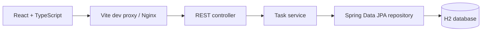

# Task Manager

A full-stack task management application with a Java Spring Boot REST API and a React + TypeScript interface. Create tasks, set priorities and due dates, and track completion from a single dashboard.

The project demonstrates layered backend design, validated API contracts, relational data modeling, and integration between a typed frontend and a Java service.

## Features

- **Task management:** Create, view, edit, and delete tasks, with a confirmation dialog before deletion.
- **Priorities and scheduling:** Assign high, medium, or low priority and an optional due date.
- **Completion tracking:** Toggle tasks between open and complete.
- **Dashboard summaries:** View counts for all tasks, completed tasks, scheduled tasks, and tasks due today.
- **Input validation:** Enforce required fields, length limits, and valid due dates on the backend.

## Tech Stack

| Layer | Technologies |
| --- | --- |
| Backend | Java 25, Spring Boot 4.0.7, Spring MVC |
| Data access | Spring Data JPA, Hibernate, H2 |
| Validation | Jakarta Bean Validation, Hibernate Validator |
| Frontend | React 19, TypeScript, Vite 7 |
| UI | Tailwind CSS, Radix UI, Lucide icons |
| Tooling | Maven, ESLint, Docker Compose, Nginx |

## Architecture



- **Separation of responsibilities:** Controllers handle HTTP requests, services manage task operations, and repositories handle database access. Dependencies use constructor injection.
- **Explicit API boundaries:** Java record DTOs and a dedicated mapper separate request and response models from JPA entities.
- **Domain modeling:** Tasks use generated UUIDs, enum-based priority and status, and creation and update timestamps. Task listings are ordered by creation time.
- **Centralized error handling:** A controller advice maps validation failures and missing-task update errors to JSON error responses.
- **Frontend state management:** A React Context provider coordinates API calls, task selection, and list refreshes after mutations. A typed API module handles requests and response conversion.
- **API proxying:** Vite proxies requests during local development; Nginx serves the built UI and proxies requests in the Docker setup.

## Getting Started

### Prerequisites

- JDK 25
- Maven available as `mvn`
- Node.js 22.12+ and npm for local frontend development, or Docker with Compose for the containerized UI

### 1. Start the backend

From the repository root:

```bash
cd backend
mvn spring-boot:run
```

The API runs at `http://localhost:8080/api/v1/tasks`. The current configuration uses an embedded, in-memory H2 database, so no external database setup is needed. Task data is reset when the backend stops.

### 2. Start the frontend

In a second terminal, from the repository root:

```bash
cd frontend
npm ci
npm run dev
```

Open [http://localhost:3000](http://localhost:3000). Vite forwards `/api` requests to the backend on port 8080.

### Alternative: Run the UI with Docker

With the backend already running on your host, run this from the repository root:

```bash
docker compose up --build
```

Open [http://localhost:3000](http://localhost:3000). Compose builds and runs the **frontend only**; Nginx forwards API requests to `host.docker.internal:8080`. Use this instead of the local Vite server, since both use port 3000.

## REST API

Base path: `/api/v1/tasks`

| Method | Endpoint | Description | Success status |
| --- | --- | --- | --- |
| `POST` | `/api/v1/tasks` | Create a task with status `OPEN` | `201 Created` |
| `GET` | `/api/v1/tasks` | List tasks in creation order | `200 OK` |
| `PUT` | `/api/v1/tasks/{taskId}` | Update a task | `200 OK` |
| `DELETE` | `/api/v1/tasks/{taskId}` | Delete a task | `204 No Content` |

### Create a task

```bash
curl -X POST http://localhost:8080/api/v1/tasks \
  -H 'Content-Type: application/json' \
  -d '{
    "title": "Prepare for a technical interview",
    "description": "Practice Java collections and REST API design",
    "priority": "HIGH"
  }'
```

The response includes `id`, `title`, `description`, `dueDate`, `priority`, and `status`. Use the returned UUID for subsequent updates or deletion.

### Request rules

| Field | Requirements |
| --- | --- |
| `title` | Required, nonblank, at most 255 characters |
| `description` | Optional, at most 1,000 characters |
| `dueDate` | Optional; `YYYY-MM-DD`, today or a future date |
| `priority` | Required: `HIGH`, `MEDIUM`, or `LOW` |
| `status` | Required for updates: `OPEN` or `COMPLETE`; set automatically on creation |

`PUT` updates all editable fields. Include the required fields and any optional values you want to retain. Due-date validation also applies to updates.

Validation failures return `400 Bad Request` with an error body such as:

```json
{
  "error": "Title must be between 1 and 255 characters"
}
```

Updating a nonexistent task also currently returns `400 Bad Request`.

## Project Structure

```text
task/
├── backend/
│   ├── src/main/java/com/maycao/task/
│   │   ├── controller/       # REST endpoints and exception handling
│   │   ├── domain/           # Request models, DTOs, and JPA entities
│   │   ├── exception/        # Domain exceptions
│   │   ├── mapper/           # DTO and domain conversions
│   │   ├── repository/       # Spring Data JPA repository
│   │   └── service/          # Task operations
│   └── src/test/             # Spring application context test
├── frontend/
│   ├── src/components/       # Task dashboard, dialogs, and UI primitives
│   ├── src/lib/              # API client, DTO types, and utilities
│   ├── src/providers/        # Shared task state
│   ├── src/types/            # Frontend domain types
│   └── Dockerfile            # Node build stage and Nginx runtime
└── docker-compose.yml        # Containerized frontend configuration
```

## Development Checks

Run backend tests from `backend/`:

```bash
mvn test
```

Run frontend linting and the TypeScript/production build from `frontend/`:

```bash
npm run lint
npm run build
```

The current backend test checks that the Spring application context loads. Endpoint, service, and frontend behavior tests are areas for future work.

## Future Improvements

- Add persistent PostgreSQL storage and versioned database migrations.
- Add authentication and task ownership for multiple users.
- Support filtering, sorting, and pagination for larger task lists.
- Expand automated tests and run checks in CI.
- Return `404 Not Found` for missing resources and refine validation for updates to overdue tasks.

## Acknowledgments

The frontend is based on the Devtiro Task App UI, as documented in its [README](frontend/README.md). Its MIT license and copyright notice are retained in [frontend/LICENSE](frontend/LICENSE).
